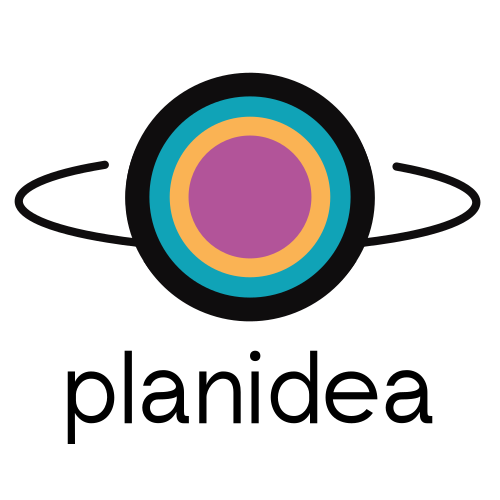

# Exception(al) - She Codes 2023/24 Plus Program Perth
## PLANIDEA - Workshops that people want 

 

     

### About
---
The Exception(al) team consist of:
* Boney Davis - Back end and front end developer
* Cindy Chen - Front end developer
* Denise Siddons - Back end developer
* Goya Zheng - Front end developer and designer
* Ida Eriksson - Project Manager
* Keerthi Mantha - Back end developer and tester 
* Suan Choi - Technical Lead and Git Manager

Planidea is our group project which is also the last project for the She Codes Plus Cohort 2023/24.
It was created from our clients issue statement "“There are lots of people with skills they want to share. and lots of people who want to learn a skill, but there is no formal way of bringing these two people together”.

The purpose of PLANIDEA is for people in the community to have an oportunity to gauge interest regarding the subject they want to organise a workshop for. And in the same way create an opportunity for learners to show interest in workshop ideas they want to go ahead. 

You can find the deployed version here: https://planidea.netlify.app/

If you are interested in the deployed back end you find it here: https://2024-exception-al-back-end.fly.dev/workshops/

### Branding (created with Canva)
---

Font used: Poppins

### Wireframes demo (created with Figma) - responsive design 
---
#### Landing page 

#### Register page 

#### All workshop ideas page 

#### Workshop idea details page

#### Accounts page 

### Minimum Viable Product (MVP)
---
#### Planidea Overview 
<video controls src="public/Overview Planidea.mp4" title="Planidea Overview video"></video>

#### Create Account & log in 
<video controls src="public/Login & register Planidea.mp4" title="Login & register"></video>
#### View all workshop ideas

#### Register expression of interest (EOI)
<video controls src="public/EOI.mp4" title="Register EOI"></video>

#### Create workshop idea
<video controls src="public/Create workshop.mp4" title="Create workshop idea"></video>

#### Filter 
<video controls src="public/Filter.mp4" title="Showcase filter"></video>

## We hope you enjoyed Planidea as much as we have <3 

